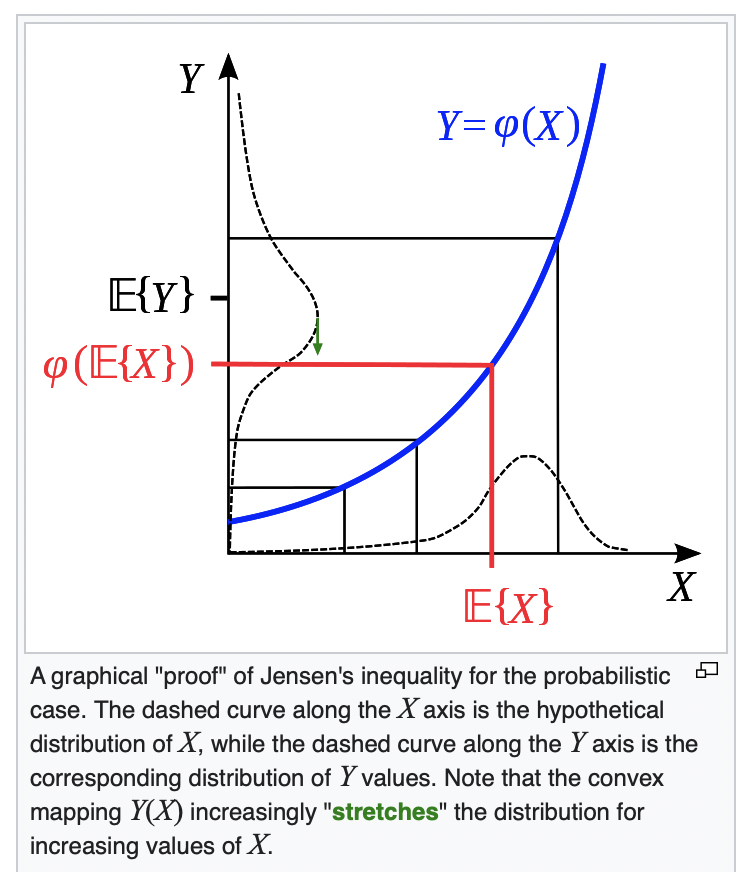

Hello there!? Is "this" you_ ,.;

The most important feature distinguishing reinforcement learning from other types of learning is that it uses training information that _evaluates the actions_ taken rather than instructs by giving correct actions. This is what creates the need for active exploration, for an explicit search for good behavior. Purely evaluative feedback indicates how good the action taken was, but not whether it was the best or the worst action possible. 

Purely instructive feedback, on the other hand, indicates the correct action to take, independently of the action actually taken. This kind of feedback is the basis of **supervised learning**, which includes large parts of pattern classification, artificial neural networks, and system identification. In their pure forms, these two kinds of feedback are quite distinct: evaluative feedback depends entirely on the action taken, whereas instructive feedback is independent of the action taken.


I like `variables`. Also some code `let mut y = 10`. 

The `cd` command or `x`.

He once said 
> This is a longer quote. Might be good for an aside. This is a longer quote. Might be good for an aside.This is a longer quote. Might be good for an aside.This is a longer quote. Might be good for an aside.This is a longer quote. Might be good for an aside.This is a longer quote. Might be good for an aside.

He is a **bold** _Italian_ dog - of course he uses [Duck Duck Go](https://duckduckgo.com). And not only that:

1. Pizza
2. Pasta
3. Burrata

:joy: :joy:

I need to highlight these ==very important words==.


Also:

* great visualisation
  * but not so great maybe?
* I'd do it anyway

# Advanced

## Math

I want inline equations like $\sum^N_i x_i^2$ which can be nice. But full equations are great too:

$$\sum^N_i y_i^3$$

Nice, huh?

Here's a simple footnote,[^1] and here's a longer one.[^bignote]


## Code

Sometimes code is nice too:
```python
import pandas as pd

data = pd.Series([
    1, 2, 3, 4, 5
])

mean = data.mean()

for i in range(10):
    print(i)

print("The mean is {mean:.2f}")

assert mean != 0
```


```rust
use crate::post::Post;

#[derive(Eq, PartialEq, Debug)]
enum MultiLineType {
    CodeBlock,
    DisplayModeMath,
    None,
}
```

## TODO

| Asset      | Allocation |
| ----------- | ----------- |
| Stocks      | 60%       |
| Bonds   | 40%        |
| Crypto | 0% |

Images, interactive graphics, svg?

{width=100%}


{width=70%}


{width=60%}

hmm

{ width=50%}

### Footnotes

___


[^1]: This is the first footnote.


[^bignote]: Here's one with multiple paragraphs and code.
    Indent paragraphs to include them in the footnote.
    `let mut x = 5;`
    Add as many paragraphs as you like.
    I like writing very long paragraphs.
    I like writing very long paragraphs.
    I like writing very long paragraphs.I like writing very long paragraphs.I like writing very long paragraphs.I like writing very long paragraphs.I like writing very long paragraphs.I like writing very long paragraphs.I like writing very long paragraphs.I like writing very long paragraphs.I like writing very long paragraphs.I like writing very long paragraphs.I like writing very long paragraphs.I like writing very long paragraphs.

[^n]: This is the nth footnote.